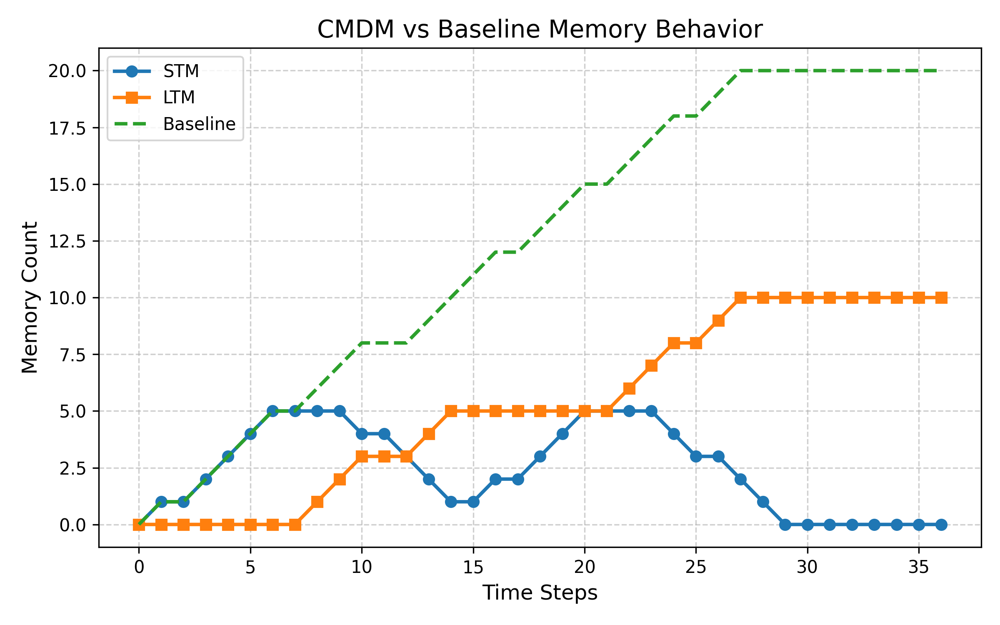

# 🧠 Contextual Memory Decay Model (CMDM)

A hybrid AI system for **efficient conversational memory management**, inspired by human cognitive behavior.

---

## 🚀 Overview

Traditional conversational AI systems store excessive context, leading to inefficiency and memory overload.

**CMDM (Contextual Memory Decay Model)** solves this by:
- Classifying messages into **Short-Term Memory (STM)** and **Long-Term Memory (LTM)**
- Applying **temporal decay** to remove irrelevant data
- Using **semantic similarity** to reinforce important information

---

## 🧩 Key Features

- 🧠 STM vs LTM classification using Machine Learning  
- ⏳ Dynamic memory decay mechanism  
- 🔁 Semantic reinforcement using cosine similarity  
- 📊 Real-time memory tracking visualization  
- ⚡ Lightweight and efficient (no heavy models)

---

## 🛠️ Tech Stack

- **Backend:** Python (Flask)  
- **Frontend:** HTML, CSS, JavaScript  
- **Machine Learning:** TF-IDF + Logistic Regression  
- **Visualization:** Chart.js  

---

## 📊 Results

- ✅ Reduced unnecessary memory growth  
- ✅ Maintained important contextual information  
- ✅ Improved efficiency compared to baseline systems  

---

## 📈 Graph

---

## 📄 Research Paper

📥 [Download Paper](cmdm-ai-memory-model/paper/Contextual_Memory_Decay_Model_CMDM.pdf)

---

## 🧠 How It Works

1. User input is converted to TF-IDF vector  
2. Logistic Regression classifies it as STM or LTM  
3. STM → fast decay  
4. LTM → slow decay  
5. Similar messages → reinforcement  

---

## 📂 Project Structure

cmdm-ai-memory-model/
├── backend/ # Flask API
├── frontend/ # User Interface
├── dataset/ # Training data
├── images/ # Graphs and visuals
├── paper/ # Research paper (PDF)
├── README.md

---

## ⚠️ Limitations

- Uses semi-synthetic dataset  
- Limited real-world evaluation  
- Simple ML model (can be improved)

---

## 🚀 Future Improvements

- Deep learning-based classification  
- Real-time adaptive memory scoring  
- Integration with LLM-based systems  

---

## 👨‍💻 Authors

- **Usnish Banerjee**  
- **Debasmita Banik**

---

## ⭐ Acknowledgment

Inspired by human memory systems and efficient AI design principles.

---

## 📌 Note

This project was developed as part of an academic research initiative in AI and memory optimization.

---

## 🌐 Connect

If you found this interesting, feel free to contact us. Thank You 
